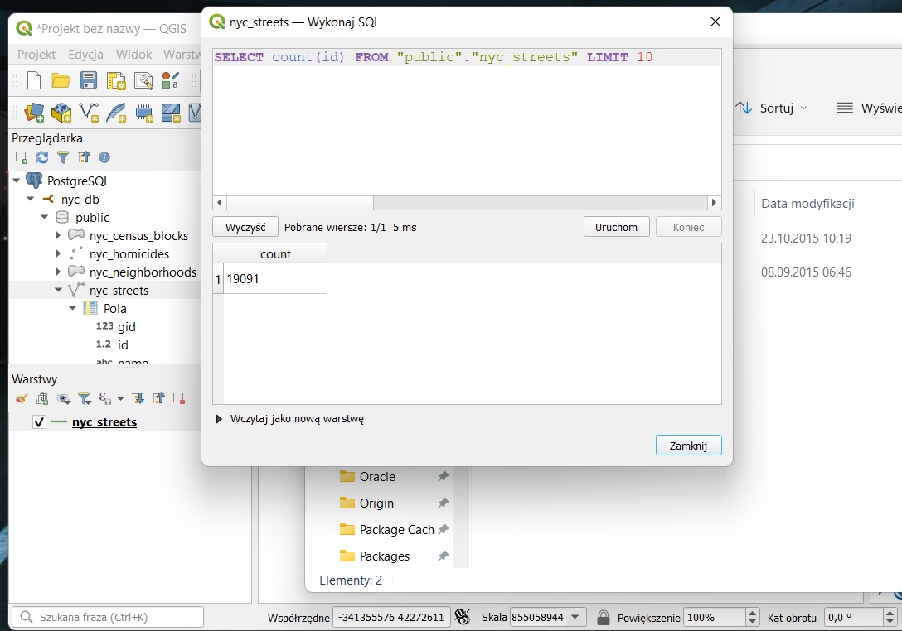
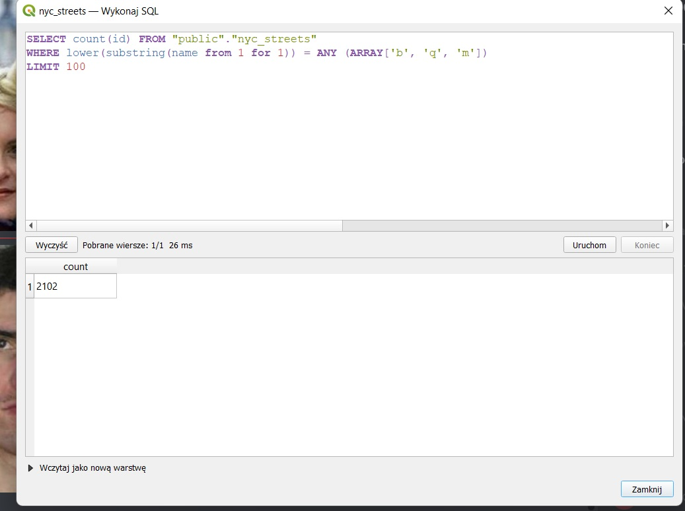
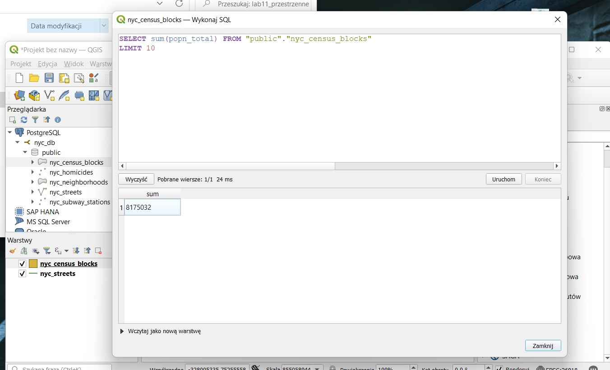
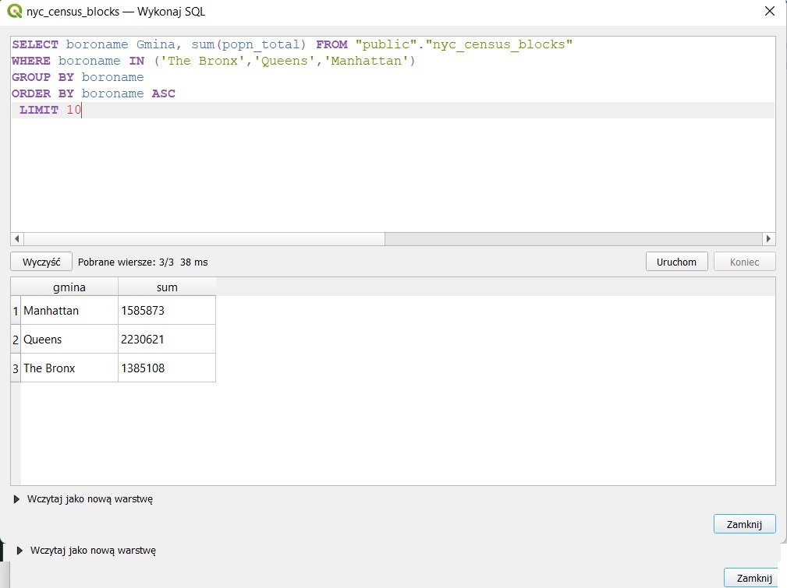
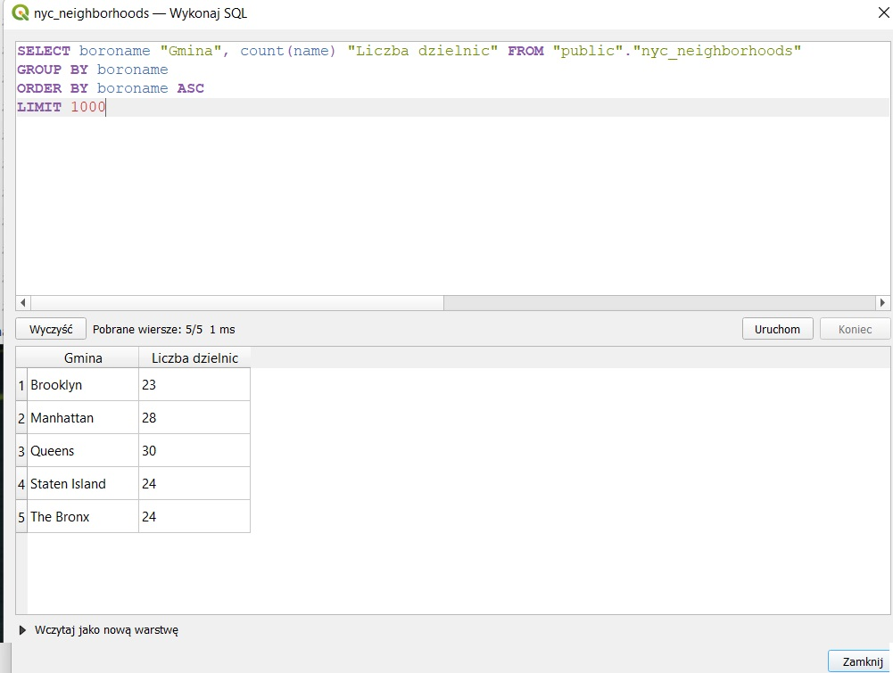

#Lab 11 odpowiedzi

1. Ile rekordów znajduje siê w tabeli nyc_streets? 
Jest **19091** wpisów.

2. Ile ulic w Nowym Jorku ma nazwy zaczynaj¹ce siê na „B”, „Q” i „M”? 
**2102**

3. Jaka jest populacja miasta Nowy Jork? 
**8 175 032**

4. Jaka jest populacja Bronxu, Manhattanu i Queens? 
Bronx: **1 385 108**  
Manhattan: **1 585 873**  
Queens: **2 230 621**

5. Ile dzielnic ("neighborhoods") znajduje siê w ka¿dej gminie (borough)? 
Brooklyn: **23** 
Manhattan: **28** 
Queens: **30** 
Staten Island: **24** 
The Bronx: **24**

